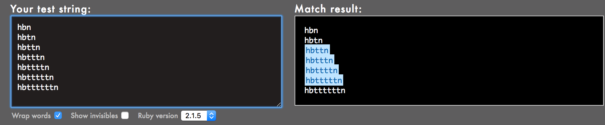

# 0x06. Regular expression
## Background Context
For this project, you have to build your regular expression using Oniguruma, a regular expression library that which is used by Ruby by default. Note that other regular expression libraries sometimes have different properties.

Because the focus of this exercise is to play with regular expressions (regex), here is the Ruby code that you should use, just replace the regexp part, meaning the code in between the `//`:
~~~~
sylvain@ubuntu$ cat example.rb
#!/usr/bin/env ruby
puts ARGV[0].scan(/127.0.0.[0-9]/).join
sylvain@ubuntu$
sylvain@ubuntu$ ./example.rb 127.0.0.2
127.0.0.2
sylvain@ubuntu$ ./example.rb 127.0.0.1
127.0.0.1
sylvain@ubuntu$ ./example.rb 127.0.0.a
~~~~
## Requirements
### General
* Allowed editors: `vi`, `vim`, `emacs`
* All your files will be interpreted on Ubuntu 20.04 LTS
* All your files should end with a new line
* A `README.md` file, at the root of the folder of the project, is mandatory
* **All your script files must be executable**
* The first line of all your Bash scripts should be exactly `#!/usr/bin/env ruby`
* All your regex must be built for the Oniguruma library
## Tasks
### 0. Simply matching School

Requirements:
* The regular expression must match `School`
* Using the project instructions, create a Ruby script that accepts one argument and pass it to a regular expression matching method

Example:
~~~~
sylvain@ubuntu$ ./0-simply_match_school.rb School | cat -e
School$
sylvain@ubuntu$ ./0-simply_match_school.rb "Best School" | cat -e
School$
sylvain@ubuntu$ ./0-simply_match_school.rb "School Best School" | cat -e
SchoolSchool$
sylvain@ubuntu$ ./0-simply_match_school.rb "Grace Hopper" | cat -e
$
~~~~
### 1. Repetition Token #0

Requirements:
* Find the regular expression that will match the above cases
* Using the project instructions, create a Ruby script that accepts one argument and pass it to a regular expression matching method
### 2. Repetition Token #1

Requirements:
* Find the regular expression that will match the above cases
* Using the project instructions, create a Ruby script that accepts one argument and pass it to a regular expression matching method
### 3. Repetition Token #2

Requirements:
* Find the regular expression that will match the above cases
* Using the project instructions, create a Ruby script that accepts one argument and pass it to a regular expression matching method
* Your regex should not contain square brackets
### 5. Not quite HBTN yet
Requirements:
* The regular expression must be exactly matching a string that starts with `h` ends with `n` and can have any single character in between
* Using the project instructions, create a Ruby script that accepts one argument and pass it to a regular expression matching method

Example:
~~~~
sylvain@ubuntu$ ./5-beginning_and_end.rb 'hn' | cat -e
$
sylvain@ubuntu$ ./5-beginning_and_end.rb 'hbn' | cat -e
hbn$
sylvain@ubuntu$ ./5-beginning_and_end.rb 'hbtn' | cat -e
$
sylvain@ubuntu$ ./5-beginning_and_end.rb 'h8n' | cat -e
h8n$
sylvain@ubuntu$
$
~~~~
### 6. Call me maybe
This task is brought to you by a professional advisor [Neha Jain][1], Senior Software Engineer at LinkedIn.

[1]: https://intranet.hbtn.io/rltoken/V4rEpseJEPRMMnfaZPbkgw
Requirement:
* The regular expression must match a 10 digit phone number

Example:
~~~~
sylvain@ubuntu$ ./6-phone_number.rb 4155049898 | cat -e
4155049898$
sylvain@ubuntu$ ./6-phone_number.rb " 4155049898" | cat -e
$
sylvain@ubuntu$ ./6-phone_number.rb "415 504 9898" | cat -e
$
sylvain@ubuntu$ ./6-phone_number.rb "415-504-9898" | cat -e
$
sylvain@ubuntu$
~~~~
### 7. OMG WHY ARE YOU SHOUTING?

Requirement:
* The regular expression must be only matching: capital letters

Example: 
~~~~
sylvain@ubuntu$ ./7-OMG_WHY_ARE_YOU_SHOUTING.rb "I realLy hOpe VancouvEr posseSs Yummy Soft vAnilla Dupper Mint Ice Nutella cream" | cat -e
ILOVESYSADMIN$
sylvain@ubuntu$ ./7-OMG_WHY_ARE_YOU_SHOUTING.rb "WHAT do you SAY?" | cat -e
WHATSAY$
sylvain@ubuntu$ ./7-OMG_WHY_ARE_YOU_SHOUTING.rb "cannot read you" | cat -e
$
sylvain@ubuntu$
~~~~